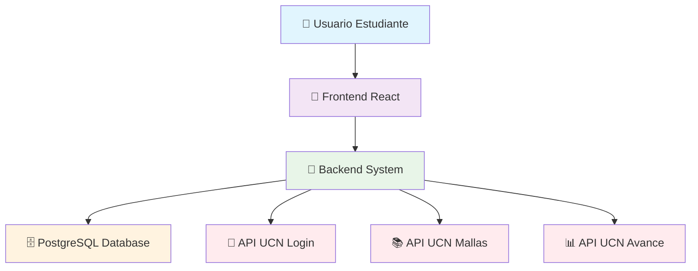

<div align="center">

# 🎓 Predict Class
### Sistema Inteligente de Proyección Académica

[](https://www.ucn.cl/)
[]()
[]()
[]()


*Proyecto Integrador - Ingeniería Civil en Computación e Informática*  
*Semestre VI - 2025*

</div>

---

## 📋 **INFORMACIÓN GENERAL**

### 🏛️ **Institución Académica**
- **Universidad:** Universidad Católica del Norte
- **Sede:** Coquimbo, Chile
- **Facultad:** Escuela de Ingeniería
- **Departamento:** Ingeniería de Sistemas y Computación
- **Profesor Guía:** Eric Ross

### 📅 **Cronograma del Proyecto**
- **📅 Fecha de Inicio:** 01 de Septiembre 2025
- **🎯 Fecha de Finalización:** 15 de Diciembre 2025
- **⏱️ Duración:** 15 semanas (7 sprints de 2 semanas)
- **👥 Carga de Trabajo:** 30 horas por sprint

### 👥 **Equipo de Desarrollo**

| Rol | Nombre | Especialidad | Email |
|-----|--------|-------------|-------|
| 🎨 **Frontend Developer** | Nicolás Cordero Varas | UI/UX & Frontend | nicolas.cordero@alumnos.ucn.cl |
| 🔧 **Scrum Master & Backend** | Branco Abalos Ortiz | Backend & APIs | branco.abalos@alumnos.ucn.cl |
| 📊 **Product Owner & QA** | Maximiliano Urrutia Araya | Testing & QA | maximiliano.urrutia@alumnos.ucn.cl |

---

## 🎯 **DESCRIPCIÓN DEL PROYECTO**

### 🔍 **Problema Central**

En la Universidad Católica del Norte, Sede Coquimbo, existe una **carencia crítica** en el sistema de proyección académica estudiantil. El sistema actual solo proporciona información estática sobre mallas curriculares y prerrequisitos, **obligando a los estudiantes a planificar manualmente** sus semestres de forma ineficiente.

### ⚡ **Problemáticas Identificadas**

> 🚨 **Ausencia de herramientas dinámicas** para proyectar estadía universitaria  
> 📊 **Falta de algoritmos de optimización** para combinaciones de ramos  
> 🔒 **Inexistencia de validación automática** de prerrequisitos y restricciones  
> ⚙️ **Carencia de personalización** según preferencias del estudiante  
> 📉 **Planificación manual ineficiente** que prolonga la permanencia universitaria  

### 🎯 **Objetivos del Proyecto**

#### 🎪 **Objetivo General**
Desarrollar un **sitio web integral** donde los estudiantes puedan revisar su trayectoria académica y proyectar su tiempo de estadía aproximado, proporcionando **la mejor combinación de ramos por semestre** para **minimizar el tiempo de titulación**.

#### 🎯 **Objetivos Específicos**

<details>
<summary><b>🎨 Fase de Diseño</b></summary>

- ✅ Crear mockup inicial del frontend
- ✅ Diseñar MER y MR de la base de datos
- ✅ Crear diagramas de arquitectura del sistema

</details>

<details>
<summary><b>🧠 Fase de Algoritmos</b></summary>

- 🔄 Diseñar algoritmo de optimización de combinaciones de ramos
- 🔄 Implementar validación dinámica de prerrequisitos
- 🔄 Desarrollar motor de recomendaciones personalizado

</details>

<details>
<summary><b>💻 Fase de Desarrollo</b></summary>

- 🔄 Implementar frontend y backend de login/registro
- 🔄 Conectar las tres APIs REST de UCN
- 🔄 Desarrollar frontend completo del sistema
- 🔄 Completar backend de la solución

</details>

<details>
<summary><b>🧪 Fase de Testing</b></summary>

- ⏳ Testing y corrección de errores
- ⏳ Deployment del proyecto

</details>

---

## 🛠️ **TECNOLOGÍAS Y ARQUITECTURA**

### 💻 **Stack Tecnológico**

<table>
<tr>
<td width="50%">

#### 🎨 **Frontend**
- 
- 
- 
- 

</td>
<td width="50%">

#### 🔧 **Backend & Database**
- 
- 
- 

</td>
</tr>
</table>

### 🔗 **APIs UCN Integradas**

| API | Propósito | Estado |
|-----|-----------|---------|
| 🔐 **API de Inicio de Sesión** | Autenticación y validación de usuarios | 🔄 En desarrollo |
| 📚 **API de Mallas Curriculares** | Información de planes de estudio y prerrequisitos | ⏳ Pendiente |
| 📊 **API de Avance Curricular** | Situación académica actual de estudiantes | ⏳ Pendiente |

### 🛠️ **Herramientas de Desarrollo**


### 🏗️ **Arquitectura del Sistema**



---

## 🚀 **FUNCIONALIDADES PRINCIPALES**

### 🎯 **Requisitos Funcionales**

<table>
<tr>
<td width="25%" align="center">

#### 📊 **Sistema de Proyecciones**


Proyección dinámica de estadía en semestres con algoritmo de optimización

</td>
<td width="25%" align="center">

#### 📈 **Visualización de Avance**


Dashboard de trayectoria académica y seguimiento de progreso

</td>
<td width="25%" align="center">

#### 🔐 **Sistema de Login**


Autenticación segura integrada con APIs UCN

</td>
<td width="25%" align="center">

#### 💾 **Guardado de Proyecciones**


Persistencia de proyecciones personalizadas del usuario

</td>
</tr>
</table>

### ⚙️ **Requisitos No Funcionales**

- 🔒 **Seguridad:** Correcto guardado y uso de datos personales
- 🎨 **Usabilidad:** Navegabilidad amigable para usuarios
- 🚀 **Performance:** Experiencia fluida en la plataforma

### 🎮 **Funcionalidades Detalladas**

#### 🔐 **Sistema de Autenticación**
- [x] Interfaz de login/registro responsive
- [x] Validación en tiempo real
- [x] Integración con API UCN (en desarrollo)

#### 📊 **Motor de Proyecciones**
- [ ] **Cálculo dinámico** de duración estimada de carrera
- [ ] **Algoritmo de optimización** para combinaciones de ramos
- [ ] **Validación automática** de prerrequisitos
- [ ] **Restricciones específicas** (ej: Capstone Project en último semestre)
- [ ] **Preferencias personalizadas** (carga máxima por semestre)

#### 📈 **Dashboard Académico**
- [ ] **Visualización de avance** curricular
- [ ] **Ramos aprobados/reprobados**
- [ ] **Proyección de semestres restantes**
- [ ] **Recomendaciones inteligentes**

---

## 📋 **METODOLOGÍA SCRUM**

### 🔄 **Planificación de Sprints**

<div align="center">

| Sprint | Duración | Fechas | Objetivos Principales | Estado |
|:------:|:--------:|:------:|:---------------------|:------:|
| **Sprint 1** | 2 semanas | 01/09 - 14/09 | Mockups y Arquitectura | 🔄 **Actual** |
| **Sprint 2** | 2 semanas | 15/09 - 28/09 | MER/MR y Diseño BD | ⏳ Pendiente |
| **Sprint 3** | 2 semanas | 29/09 - 12/10 | Algoritmo de Optimización | ⏳ Pendiente |
| **Sprint 4** | 2 semanas | 13/10 - 26/10 | Backend y APIs | ⏳ Pendiente |
| **Sprint 5** | 2 semanas | 27/10 - 09/11 | Frontend Principal | ⏳ Pendiente |
| **Sprint 6** | 2 semanas | 10/11 - 23/11 | Integración Completa | ⏳ Pendiente |
| **Sprint 7** | 2 semanas | 24/11 - 07/12 | Testing y Deployment | ⏳ Pendiente |

</div>

### 📊 **Distribución del Trabajo**
- **⏰ Total horas por sprint:** 30 horas
- **👥 Horas por miembro:** 5 horas semanales
- **🎯 Asignación:** Según habilidades específicas del equipo

---

## 🎪 **STAKEHOLDERS Y USUARIOS**

### 👥 **Usuarios Principales**

<table>
<tr>
<td width="50%">

#### 🎓 **Estudiantes UCN**
- **Beneficio:** Optimización de trayectoria académica
- **Impacto:** Reducción del tiempo de titulación
- **Uso:** Proyecciones personalizadas y recomendaciones

</td>
<td width="50%">

#### 🏛️ **Gestión Universitaria**
- **Beneficio:** Planificación de recursos y espacios
- **Impacto:** Optimización administrativa
- **Uso:** Datos para planificación semestral

</td>
</tr>
</table>

---

## 🛡️ **GESTIÓN DE RIESGOS**

### ⚠️ **Riesgos Identificados**

| Riesgo | Probabilidad | Impacto | Mitigación |
|--------|:------------:|:-------:|-----------|
| 🏥 **Problemas personales del equipo** | Media | Alto | Cronograma flexible y redistribución de tareas |
| 💻 **Incomprensión de tecnologías** | Baja | Medio | Investigación intensiva y capacitación |
| 🌐 **Caídas de APIs UCN** | Alta | Alto | Datos de prueba locales y sistema offline |

---

## ✅ **CRITERIOS DE ACEPTACIÓN**

### 🎯 **Definición de Éxito**

<details>
<summary><b>🔐 Sistema de Login</b></summary>

**Criterio:** Validación correcta con datos válidos e inválidos  
**Verificación:** Testing con casos de prueba específicos  
**Estado:** 🔄 En desarrollo

</details>

<details>
<summary><b>📊 Visualización de Avance</b></summary>

**Criterio:** Concordancia exacta con datos de APIs UCN  
**Verificación:** Comparación con registros oficiales  
**Estado:** ⏳ Pendiente

</details>

<details>
<summary><b>📈 Proyección de Semestres</b></summary>

**Criterio:** Proyecciones válidas respetando créditos y prerrequisitos  
**Verificación:** Testing con múltiples escenarios  
**Estado:** ⏳ Pendiente

</details>

<details>
<summary><b>💾 Sistema de Guardado</b></summary>

**Criterio:** Persistencia de proyecciones entre sesiones  
**Verificación:** Testing de login/logout  
**Estado:** ⏳ Pendiente

</details>

---

## 🚀 **INSTALACIÓN Y DESARROLLO**

### 📋 **Requisitos Previos**
- Node.js 18+
- PostgreSQL 14+
- Git
- Docker (opcional)

### ⚡ **Instalación Rápida**

```bash
# Clonar el repositorio
git clone https://github.com/Nicolas-Cordero/frontend-proyecto-integrador.git
cd frontend-proyecto-integrador

# Instalar dependencias
npm install

# Configurar variables de entorno
cp .env.example .env

# Ejecutar en modo desarrollo
npm run dev
```

### 🐳 **Con Docker**

```bash
# Construir y ejecutar contenedores
docker-compose up --build

# La aplicación estará disponible en http://localhost:3000
```

---

## 📁 **ESTRUCTURA DEL PROYECTO**

```
predict-class/
├── 📁 frontend/
│   ├── 📁 src/
│   │   ├── 📁 components/     # Componentes React
│   │   ├── 📁 pages/         # Páginas principales
│   │   ├── 📁 hooks/         # Custom hooks
│   │   ├── 📁 services/      # Servicios API
│   │   └── 📁 utils/         # Utilidades
│   ├── 📁 public/            # Archivos públicos
│   └── 📄 package.json       # Dependencias frontend
├── 📁 backend/
│   ├── 📁 src/
│   │   ├── 📁 controllers/   # Controladores
│   │   ├── 📁 models/        # Modelos de datos
│   │   ├── 📁 routes/        # Rutas API
│   │   └── 📁 middleware/    # Middlewares
│   └── 📄 package.json       # Dependencias backend
├── 📁 database/
│   ├── 📁 migrations/        # Migraciones BD
│   ├── 📁 seeders/          # Datos de prueba
│   └── 📄 schema.sql        # Esquema de BD
├── 📁 docs/
│   ├── 📄 architecture.md    # Documentación técnica
│   ├── 📄 api-docs.md       # Documentación API
│   └── 📁 mockups/          # Diseños y mockups
├── 📄 docker-compose.yml    # Configuración Docker
├── 📄 README.md             # Este archivo
└── 📄 Guía_Documento_Inicial.pdf
```

---

## 🔗 **RECURSOS Y ENLACES**

### 📚 **Documentación Técnica**
- 📖 [Documentación de APIs](./docs/api-docs.md)
- 🏗️ [Arquitectura del Sistema](./docs/architecture.md)
- 🎨 [Guía de Diseño](./docs/design-guide.md)

### 🌐 **Enlaces Útiles**
- 🏛️ [Universidad Católica del Norte](https://www.ucn.cl/)
- 📊 [Jira del Proyecto](https://predict-class.atlassian.net/)
- 💻 [Repositorio GitHub](https://github.com/Nicolas-Cordero/frontend-proyecto-integrador)

---

## 📞 **CONTACTO Y SOPORTE**

### 👨‍💻 **Equipo de Desarrollo**

<div align="center">

| Nicolás Cordero | Branco Abalos | Maximiliano Urrutia |
|:---------------:|:-------------:|:-------------------:|
| 🎨 Frontend Lead | 🔧 Scrum Master | 📊 Product Owner |
| nicolas.cordero@alumnos.ucn.cl | branco.abalos@alumnos.ucn.cl | maximiliano.urrutia@alumnos.ucn.cl |

</div>

### 🎓 **Información Académica**
- **📧 Contacto Institucional:** Escuela de Ingeniería - UCN Coquimbo
- **🏛️ Dirección:** Larrondo 1281, Coquimbo, Chile
- **📞 Teléfono:** +56 51 220 9000

---

<div align="center">

### 🌟 **¡Gracias por tu interés en Predict Class!** 🌟

[]()

*Documento generado como parte del Proyecto Integrador - Semestre VI 2025*  
*Universidad Católica del Norte - Sede Coquimbo*

**Última actualización:** 28 de Septiembre 2025 | **Versión:** 1.0

</div>