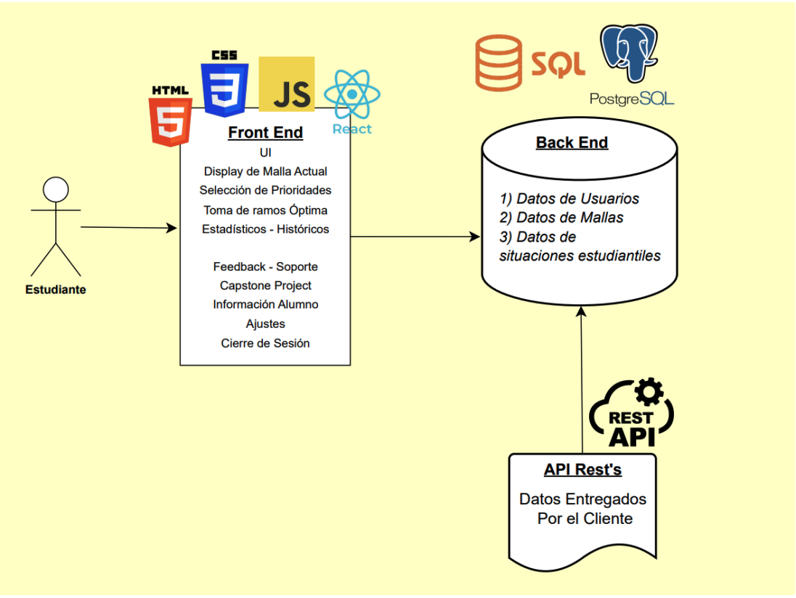

<div align="center">

# 🎓 Predict Class
### Sistema Inteligente de Proyección Académica

[](https://www.ucn.cl/)
[]()
[]()
[]()


*Proyecto Integrador Software- Ingeniería Civil en Computación e Informática*  
*Semestre VI - 2025*

</div>

---

## 📋 **INFORMACIÓN GENERAL**

### 🏛️ **Institución Académica**
- **Universidad:** Universidad Católica del Norte
- **Sede:** Coquimbo, Chile
- **Facultad:** Escuela de Ingeniería
- **Profesor Guía:** Eric Ross

### 📅 **Cronograma del Proyecto**
- **📅 Fecha de Inicio:** 01 de Septiembre 2025
- **🎯 Fecha de Finalización:** 15 de Diciembre 2025
- **⏱️ Duración:** 15 semanas (7 sprints de 2 semanas)
- **👥 Carga de Trabajo:** 30 horas aproximadas por sprint

### 👥 **Equipo de Desarrollo**

| Nombre | Email |
|--------|-------|
| Branco Abalos Ortiz | branco.abalos@alumnos.ucn.cl |
| Nicolás Cordero Varas | nicolas.cordero01@alumnos.ucn.cl |
| Maximiliano Urrutia Araya | maximiliano.urrutia@alumnos.ucn.cl |

---

## 🎯 **DESCRIPCIÓN DEL PROYECTO**

### 🔍 **Problema Central**

En la Universidad Católica del Norte, Sede Coquimbo, existe una **carencia** en el sistema de proyección académica estudiantil. El sistema actual solo proporciona información estática sobre mallas curriculares y prerrequisitos, **obligando a los estudiantes a planificar manualmente** sus semestres de forma ineficiente.

### ⚡ **Problemáticas Identificadas**

> 🚨 **Ausencia de herramientas dinámicas** para proyectar estadía universitaria  
> 📊 **Falta de algoritmos de optimización** para combinaciones de ramos  
> 🔒 **Inexistencia de validación automática** de prerrequisitos y restricciones  
> ⚙️ **Carencia de personalización** según preferencias del estudiante  
> 📉 **Planificación manual ineficiente** que prolonga la permanencia universitaria  

### 🎯 **Objetivos del Proyecto**

#### 🎪 **Objetivo General**
Desarrollar un **sitio web integral** donde los estudiantes puedan revisar su trayectoria académica y proyectar su tiempo de estadía aproximado, proporcionando **la mejor combinación de ramos por semestre** para **minimizar el tiempo de titulación**.

#### 🎯 **Objetivos Específicos**

<details>
<summary><b>🎨 Diseño</b></summary>

- ✅ Crear mockup inicial del frontend
- ✅ Diseñar MER y MR de la base de datos
- ✅ Crear diagramas de arquitectura del sistema

</details>

<details>
<summary><b>🧠 Algoritmo de optimización académica</b></summary>

- 🔄 Diseñar algoritmo de optimización de combinaciones de ramos
- 🔄 Implementar validación dinámica de prerrequisitos
- 🔄 Desarrollar motor de recomendaciones personalizado

</details>

<details>
<summary><b>💻 Desarrollo</b></summary>

- 🔄 Implementar frontend y backend de login/registro
- 🔄 Conectar las tres APIs REST de UCN
- 🔄 Desarrollar frontend completo del sistema
- 🔄 Completar backend de la solución

</details>

<details>
<summary><b>🧪 Testing</b></summary>

- ⏳ Testing y corrección de errores
- ⏳ Deployment del proyecto

</details>

---

## 🛠️ **TECNOLOGÍAS Y ARQUITECTURA**

### 💻 **Stack Tecnológico**

<table>
<tr>
<td width="50%">

#### 🎨 **Frontend**
- 
- 
- 
- 

</td>
<td width="50%">

#### 🔧 **Backend & Database**
- 
- 
- 

</td>
</tr>
</table>

### 🔗 **APIs UCN Integradas**

| API | Propósito |
|-----|-----------|
| 🔐 **API de Inicio de Sesión** | Autenticación y validación de usuarios |
| 📚 **API de Mallas Curriculares** | Información de planes de estudio y prerrequisitos |
| 📊 **API de Avance Curricular** | Situación académica actual de estudiantes |

### 🛠️ **Herramientas de Desarrollo**

[](https://github.com)
[](https://www.atlassian.com/software/jira)
[](https://code.visualstudio.com)
[](https://www.docker.com)
[](https://app.diagrams.net)
[](https://discord.com)

### 🏗️ **Arquitectura del Sistema**

<div align="center">



</div>

---
## 📋 **METODOLOGÍA SCRUM**

### 🔄 **Planificación de Sprints**

<div align="center">

| Sprint | Duración | Fechas | Estado |
|:------:|:--------:|:------:|:------:|
| **Sprint 1** | 2 semanas | 01/09 - 14/09 | ✅ **Completado** |
| **Sprint 2** | 2 semanas | 15/09 - 28/09 | ✅ **Completado** |
| **Sprint 3** | 2 semanas | 29/09 - 12/10 | ✅ **Completado**  |
| **Sprint 4** | 2 semanas | 13/10 - 26/10 | 🔄 **Actual** |
| **Sprint 5** | 2 semanas | 27/10 - 09/11 | ⏳ Pendiente |
| **Sprint 6** | 2 semanas | 10/11 - 23/11 | ⏳ Pendiente |
| **Sprint 7** | 2 semanas | 24/11 - 07/12 | ⏳ Pendiente |

</div>

### 📊 **Distribución del Trabajo**
- **⏰ Total horas por sprint:** 30 horas aproximadamente
- **👥 Horas por miembro:** 5 horas semanales
- **🎯 Asignación:** Según habilidades específicas del equipo

---

## 🚀 **INSTALACIÓN Y DESARROLLO**

### 📋 **Requisitos Previos**
- Node.js 18+
- PostgreSQL 14+
- Git
- Docker (opcional)

### ⚡ **Instalación Rápida**

```bash
# Clonar el repositorio
git clone https://github.com/Nicolas-Cordero/frontend-proyecto-integrador.git
cd frontend-proyecto-integrador

# Instalar dependencias
npm install

# Configurar variables de entorno
cp .env.example .env

# Ejecutar en modo desarrollo
npm run dev
```


---

## 📁 **ESTRUCTURA DEL PROYECTO**

```
frontend-proyecto-integrador/
├── .git/                  # Control de versiones Git
├── frontend/                          # Aplicación cliente web
│   ├── html/                          # Páginas HTML (vistas)
│   │   ├── index.html                    # Página de login
│   │   ├── main-menu.html                # Dashboard principal
│   │   ├── malla-actual.html             # Vista de malla curricular actual
│   │   ├── historico.html                # Vista de histórico de avance
│   │   ├── perfil-usuario.html           # Perfil del usuario
│   │   └── mallas (urr).html             # HTML base para mallas
│   ├── css/                              # Hojas de estilo
│   │   ├── index-styles.css              # Estilos del login
│   │   ├── main-menu.css                 # Estilos del dashboard
│   │   ├── historico-scoped.css          # Estilos de histórico
│   │   ├── historico-estadisticas.css    # Estilos de estadísticas
│   │   ├── malla-actual.css              # Estilos de malla actual
│   │   ├── perfil-usuario-styles.css     # Estilos de perfil
│   │   └── style-mallas.css              # Estilos de mallas
│   ├── js/                               # Lógica JavaScript
│   │   ├── index-script.js               # Lógica del login
│   │   ├── main-menu-script.js           # Lógica del dashboard
│   │   ├── historico-script.js           # Lógica de histórico
│   │   ├── malla-actual.js               # Lógica de malla actual
│   │   ├── mallas-api.js                 # Funciones API para mallas
│   │   ├── mallas-ui.js                  # Renderización UI de mallas
│   │   ├── mallas.js                     # Orquestación de mallas
│   │   ├── perfil-usuario-script.js      # Lógica de perfil
│   │   ├── proxy-server.js               # Servidor proxy local
│   │   ├── toast-ui.js                   # UI para notificaciones
│   │   └── mockups.js                    # Datos simulados
│   ├── images/                           # Recursos gráficos
│   │   ├── profile-pictures/             # Fotos de perfil
│   │   ├── arquitectura.png              # Diagrama de arquitectura
│   │   ├── coquimbo.jpg                  # Imagen de fondo
│   │   ├── ucn-logo.png                  # Logo UCN
│   │   └── ucn-name.png                  # Nombre institucional UCN
│   ├── package.json                      # Dependencias frontend
│   ├── package-lock.json                 # Lock de versiones
│   └── README.md                         # Documentación frontend
├── backend/                              # Servidor API (backend-simulacion-ramos)
│   ├── src/                              # Código fuente del backend
│   │   ├── rutas/                        # Endpoints API
│   │   │   ├── estudiantes.js            # Rutas de estudiantes
│   │   │   ├── cursos.js                 # Rutas de cursos
│   │   │   └── simulaciones.js           # Rutas de simulaciones
│   │   ├── utilidades/                   # Módulos auxiliares
│   │   │   └── archivos-simulaciones.js  # Gestión de archivos JSON
│   │   ├── servidor.js                   # Servidor Express principal
│   │   ├── base-datos.js                 # Inicialización SQLite
│   │   └── configuracion.js              # Configuración global
│   ├── data/                             # Almacenamiento persistente
│   │   ├── simulador.sqlite              # Base de datos SQLite
│   │   └── simulaciones/                 # Archivos JSON de simulaciones
│   ├── package.json                      # Dependencias backend
│   ├── package-lock.json                 # Lock de versiones
│   ├── .gitignore                        # Archivos ignorados en Git
│   ├── README.md                         # Documentación backend
│   └── .env (no versionado)              # Variables de entorno
├── README.md                             # Este archivo de documentación
├── guia-uso.txt                          # Guía de uso del proyecto
├── .gitattributes                        # Configuración de Git
└── Guía_Documento_Inicial.pdf            # Documentación oficial del proyecto
```
---